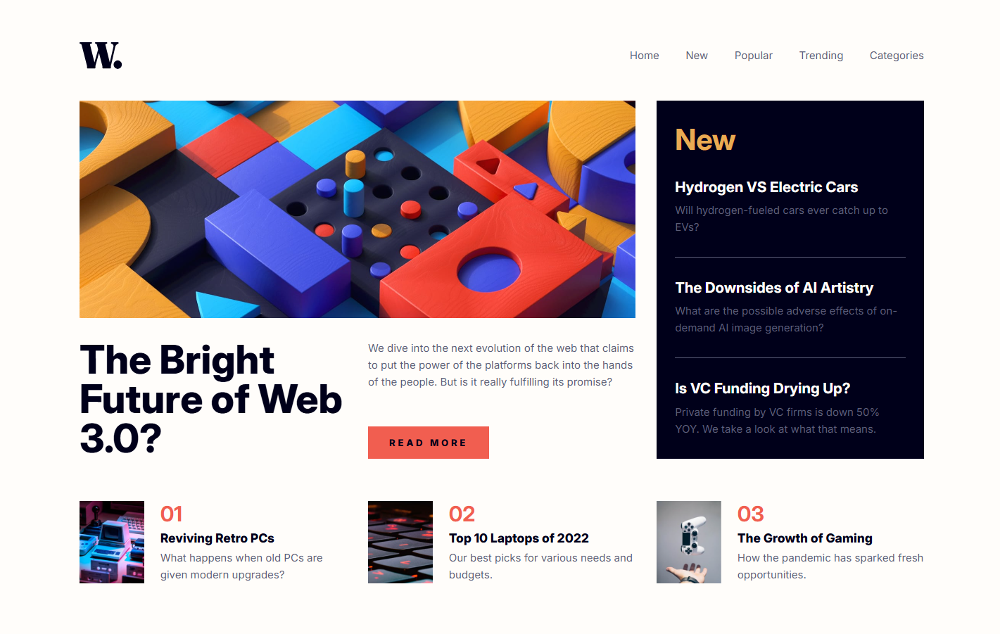

# News homepage

This is a solution to the [News homepage challenge on Frontend Mentor](https://www.frontendmentor.io/challenges/news-homepage-H6SWTa1MFl). Frontend Mentor challenges help you improve your coding skills by building realistic projects. 

## Table of contents

- [Overview](#overview)
  - [The challenge](#the-challenge)
  - [Screenshot](#screenshot)
  - [Links](#links)
- [My process](#my-process)
  - [Built with](#built-with)
- [Author](#author)
## Overview

### The challenge

Users should be able to:

- View the optimal layout for the interface depending on their device's screen size
- See hover and focus states for all interactive elements on the page

### Screenshot

### Links

- Solution URL: [here!](https://www.frontendmentor.io/solutions/responsive-news-homepage-built-with-html-css-and-javascript--41_FAt75H)
- Live Site URL: [here!](https://mohamed-devp.github.io/news-homepage/)

## My process

### Built with

- Semantic HTML5 markup
- CSS custom properties
- Flexbox
- CSS Grid

## Author

- Frontend Mentor - [@Mohamed-Devp](https://www.frontendmentor.io/profile/Mohamed-Devp)